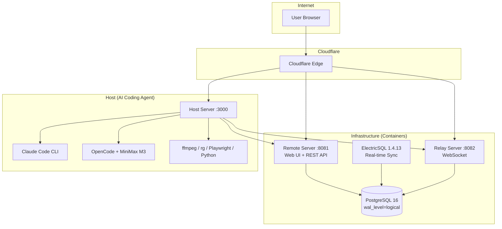

<p align="center">
  
</p>

<h1 align="center">Woow Vibe Kanban Docker Compose All</h1>

<p align="center">
  <strong>Complete Self-Hosted Vibe Kanban Suite — Two Deployment Options</strong><br/>
  K3s Kubernetes | Podman + Ubuntu Native
</p>

<p align="center">
  
  
  
</p>

---

## Deployment Options

| | K3s / Kubernetes | Podman + Ubuntu |
|---|---|---|
| **Branch** | [`k3s`](../../tree/k3s) | [`podman-ubuntu`](../../tree/podman-ubuntu) |
| **Host** | Containerized (Pod) | Native (systemd service) |
| **Infra** | K8s Deployments + Services | podman-compose (4 containers) |
| **Tunnel** | Dedicated CF Tunnel (K8s pod) | CF Tunnel (shared/native) |
| **Terminal** | ttyd (K8s pod) | ttyd (systemd service) |
| **Persistence** | NFS PVC + initContainer | ~/.vibe-kanban-tools/ |
| **Best for** | Multi-node clusters, production | Single machine, development |

## Architecture



## CLI Tool Stack (both deployments)

| Category | Tools |
|----------|-------|
| Languages | Python 3.12, Node.js 22, npm, npx, corepack |
| Package Mgr | uv 0.11+, pip |
| Multimedia | ffmpeg 7.0.2 (static), ffprobe |
| Search | ripgrep 14.1+, ddgs (DuckDuckGo) |
| Browser | Playwright 1.61 + Chromium |
| AI | Claude Code 2.1+, OpenCode 1.17+ (MiniMax M3) |
| Runtime | .NET 8.0 |
| Python (90+ pkgs) | anthropic, openai, mcp, fastapi, uvicorn, pydantic, numpy, pandas, rich, playwright... |

## Live Instance

| Service | URL |
|---------|-----|
| Remote (Web UI) | https://woowtechkxs-vibekanban.woowtech.io |
| Relay | https://woowtechkxs-vibekanban-relay.woowtech.io |
| Host UI | https://woowtechkxs-vibekanban-host.woowtech.io |
| Terminal (ttyd) | https://woowtechkxs-vibekanban-terminal.woowtech.io |

## Quick Start

### K3s
```bash
git checkout k3s
kubectl apply -f k8s-manifests/vibe-kanban/
```

### Podman + Ubuntu
```bash
git checkout podman-ubuntu
cd podman-stack
cp .env.example .env && vim .env
bash build-images-v2.sh
bash start.sh
bash install-host-tools.sh
```

## Screenshots

<p align="center">
  
  
</p>
<p align="center">
  
  
</p>

---

## [中文文件 README_zh-TW.md](README_zh-TW.md)

---

<p align="center">
  <sub>Built by <a href="https://github.com/WOOWTECH">WOOWTECH</a> | Powered by <a href="https://github.com/BloopAI/vibe-kanban">Vibe Kanban</a> + <a href="https://opencode.ai">OpenCode</a></sub>
</p>
