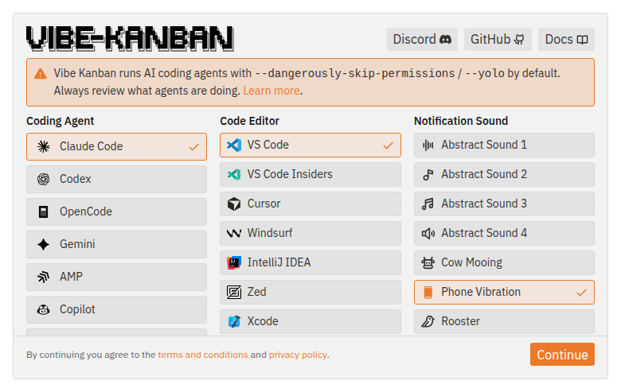
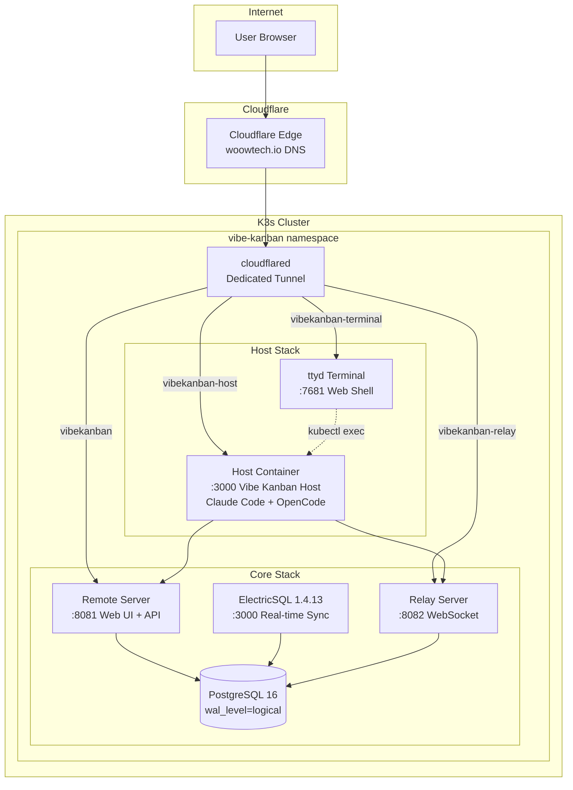
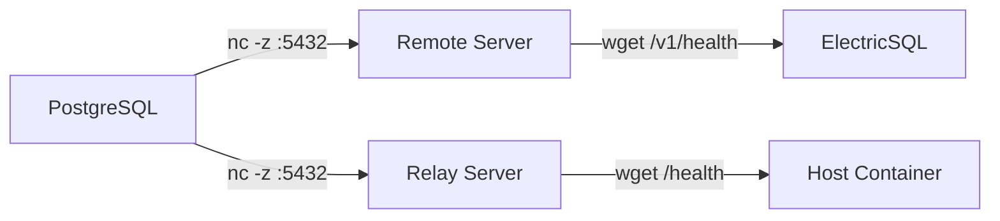
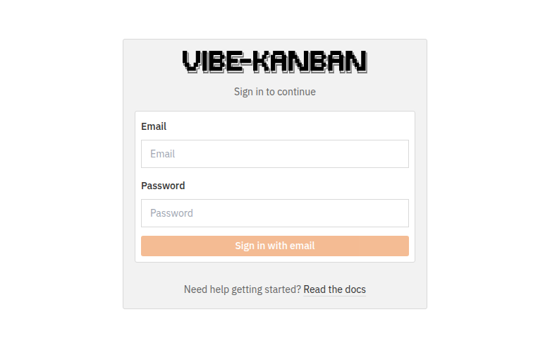
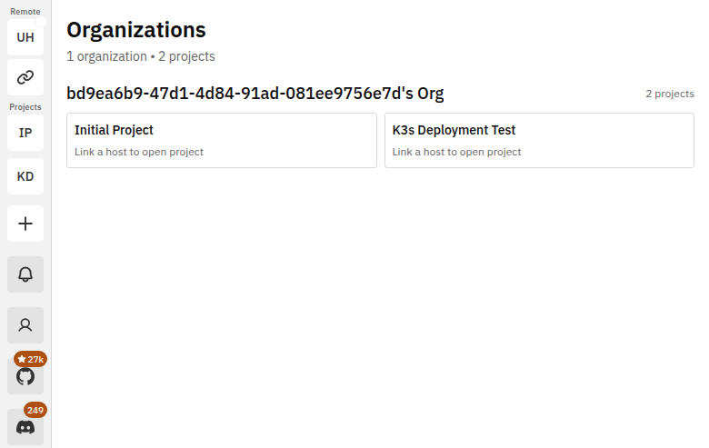
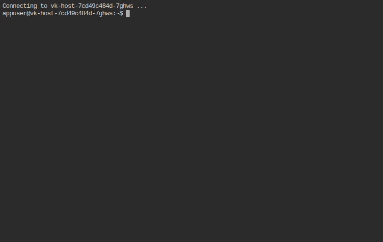
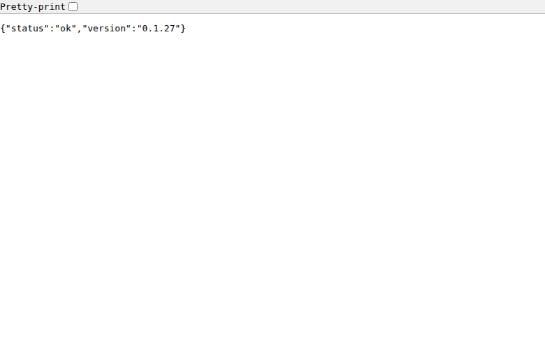
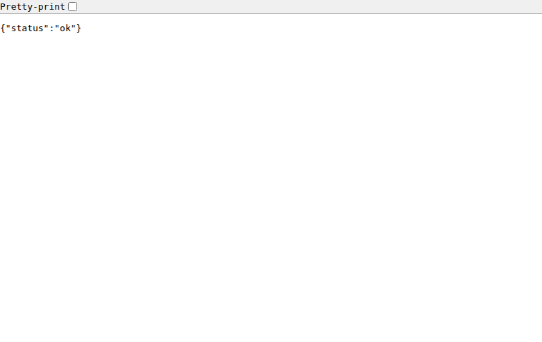

<p align="center">
  
</p>

<h1 align="center">Woow Vibe Kanban Docker Compose All</h1>

<p align="center">
  <strong>Complete Self-Hosted Vibe Kanban Suite on K3s / Kubernetes</strong><br/>
  Remote Server + Relay + ElectricSQL + Host (Claude Code & OpenCode) + Web Terminal
</p>

<p align="center">
  <a href="#features">Features</a> &bull;
  <a href="#architecture">Architecture</a> &bull;
  <a href="#components">Components</a> &bull;
  <a href="#screenshots">Screenshots</a> &bull;
  <a href="#deployment">Deployment</a> &bull;
  <a href="#configuration">Configuration</a> &bull;
  <a href="#verification">Verification</a> &bull;
  <a href="README_zh-TW.md">中文文件</a>
</p>

<p align="center">
  
  
  
  
  
  
  
</p>

---

## Overview

A production-ready, fully containerized deployment of [Vibe Kanban](https://github.com/BloopAI/vibe-kanban) on K3s / Kubernetes. All 7 services run in a single `vibe-kanban` namespace with a dedicated Cloudflare Tunnel for external access.

The Host container comes pre-installed with **Claude Code CLI** and **OpenCode** (with MiniMax M3), enabling AI-powered coding directly from a browser-based terminal.

### Why This Package?

| Challenge | Solution |
|-----------|----------|
| Vibe Kanban upstream sunset (v0.1.44 export-only) | Pinned to v0.1.43 with pre-built binaries + rebuilt frontend |
| Host runs natively, not containerized | Custom Docker image with Ubuntu 24.04 + server binary + AI tools |
| OpenCode/Claude Code need terminal access | Web-based ttyd terminal with kubectl exec into host pod |
| ElectricSQL requires strict startup ordering | InitContainers enforce DB → Remote → Electric dependency chain |
| Cloudflare routing for multiple services | Dedicated tunnel with API-managed ingress rules |

---

## Features

### Core Platform
- **PostgreSQL 16** with `wal_level=logical` for ElectricSQL real-time sync
- **ElectricSQL 1.4.13** — real-time data synchronization engine
- **Remote Server** — Web UI + REST API (Vibe Kanban v0.1.43)
- **Relay Server** — WebSocket relay for host connections

### AI-Powered Host
- **Claude Code CLI** (v2.1.201) — Anthropic's terminal AI coding agent
- **OpenCode** (v1.17.13) — Open-source AI coding agent with 75+ LLM providers
- **MiniMax M3** — Pre-configured AI provider via Token Plan
- **Git, Node.js 22, NPM** — Full development environment in container

### Infrastructure
- **Web Terminal (ttyd)** — Browser-based shell access to host container
- **Dedicated Cloudflare Tunnel** — API-managed routes, no shared tunnel interference
- **NetworkPolicies** — Database isolation, service-level access control
- **NFS-backed workspace** — Persistent 20Gi storage for worktrees and configs
- **InitContainer ordering** — Guarantees correct startup sequence

---

## Architecture

### System Overview



### Startup Order (enforced by InitContainers)



### Network Topology

```
External URLs (via Cloudflare Tunnel):
  ┌─────────────────────────────────────────────────────────┐
  │ woowtechkxs-vibekanban.woowtech.io        → Remote:8081│
  │ woowtechkxs-vibekanban-relay.woowtech.io   → Relay:8082│
  │ woowtechkxs-vibekanban-host.woowtech.io    → Host:3000 │
  │ woowtechkxs-vibekanban-terminal.woowtech.io→ ttyd:7681 │
  └─────────────────────────────────────────────────────────┘

Internal Services (ClusterIP):
  vk-db-svc:5432        vk-remote-svc:8081
  vk-electric-svc:3000  vk-relay-svc:8082
  vk-host-svc:3000      vk-terminal-svc:7681
```

---

## Components

### Manifest Files

| File | Component | Description |
|------|-----------|-------------|
| `00-namespace.yaml` | Namespace | `vibe-kanban` namespace |
| `01-secrets.yaml.example` | Secrets | JWT, DB passwords, API keys (template) |
| `02-config.yaml` | ConfigMap | Public URLs |
| `03-storage.yaml` | PVCs | DB (10Gi), Electric (1Gi), Workspace (20Gi NFS) |
| `04-postgres.yaml` | PostgreSQL 16 | Database with WAL logical replication |
| `05-remote.yaml` | Remote Server | Web UI + REST API |
| `06-electric.yaml` | ElectricSQL | Real-time sync engine |
| `07-relay.yaml` | Relay Server | Host connection relay |
| `08-host.yaml` | Host | AI coding executor with Claude Code + OpenCode |
| `09-cloudflared.yaml` | Cloudflared | Dedicated Cloudflare Tunnel |
| `10-network-policy.yaml` | NetworkPolicies | Service isolation |
| `11-terminal.yaml` | Web Terminal | ttyd browser-based shell |
| `build-vk-images.sh` | Build Script | Image build pipeline |

### Container Images

| Image | Base | Size | Contents |
|-------|------|------|----------|
| `vk-remote:v0.1.43` | ubuntu:24.04 | ~200MB | Remote server binary + frontend dist |
| `vk-relay:v0.1.43` | ubuntu:24.04 | ~110MB | Relay server binary |
| `vk-host:v0.1.43` | ubuntu:24.04 | ~850MB | Host server + Node.js 22 + Claude Code + OpenCode |

---

## Screenshots

### Remote Server — Login Page

The Remote Server serves the Vibe Kanban web interface with local authentication.

<p align="center">
  
</p>

### Remote Server — Dashboard

Project management dashboard with kanban boards, issues, and real-time sync.

<p align="center">
  
</p>

### Host UI — Onboarding

The Host container serves its own web UI for workspace and executor management.

<p align="center">
  
</p>

### Web Terminal (ttyd)

Browser-based terminal access to the Host container. Run `claude`, `opencode`, `git`, and more.

<p align="center">
  
</p>

### Health Endpoints

All services expose health endpoints for monitoring.

<p align="center">
  
  
</p>

### Kubernetes Pod Status

All 7 pods running in the `vibe-kanban` namespace:

```
NAME                             READY   STATUS    RESTARTS   AGE
vk-cloudflared-8c7d94dc7-lwzk6   1/1     Running   0          23h
vk-db-797576d855-sl754           1/1     Running   1          23h
vk-electric-58b559f886-fl7h2     1/1     Running   1          23h
vk-host-7cd49c484d-7ghws         1/1     Running   1          22h
vk-relay-85f989bff4-4gxhl        1/1     Running   1          23h
vk-remote-59dff84b-q9cnj         1/1     Running   1          23h
vk-terminal-6d76c74f4f-f6wdj     1/1     Running   0          23h
```

---

## Deployment

### Prerequisites

- K3s / Kubernetes cluster (v1.28+)
- `kubectl` configured with cluster access
- `podman` or `docker` for building images
- Cloudflare account with API token (for tunnel creation)
- Vibe Kanban source repo (`git clone https://github.com/BloopAI/vibe-kanban.git`)

### Step 1: Build Images

```bash
# Checkout v0.1.43 tag
cd /path/to/vibe-kanban
git checkout v0.1.43-20260417125614

# Build frontend (bakes relay URL into JS bundles)
VITE_RELAY_API_BASE_URL="https://your-relay-domain.example.com" \
  NODE_OPTIONS="--max-old-space-size=4096" \
  pnpm -C packages/local-web build
pnpm -C packages/remote-web build

# Build host binary
export LIBCLANG_PATH=/usr/lib/llvm-18/lib OPENSSL_NO_VENDOR=1
cargo build --release --bin server

# Build container images
chmod +x k8s-manifests/vibe-kanban/build-vk-images.sh
./k8s-manifests/vibe-kanban/build-vk-images.sh
```

### Step 2: Import Images to K3s

```bash
# Save and import via privileged Job (see build-vk-images.sh)
podman save localhost/vk-remote:v0.1.43 | sudo k3s ctr images import -
podman save localhost/vk-relay:v0.1.43  | sudo k3s ctr images import -
podman save localhost/vk-host:v0.1.43   | sudo k3s ctr images import -
```

### Step 3: Create Cloudflare Tunnel

```bash
# Create tunnel
curl -X POST "https://api.cloudflare.com/client/v4/accounts/{ACCOUNT_ID}/cfd_tunnel" \
  -H "Authorization: Bearer {API_TOKEN}" \
  -d '{"name":"vibe-kanban-k3s","tunnel_secret":"'$(openssl rand -base64 32)'"}'

# Configure routes
curl -X PUT ".../cfd_tunnel/{TUNNEL_ID}/configurations" \
  -d '{"config":{"ingress":[
    {"hostname":"your-remote.example.com","service":"http://vk-remote-svc:8081"},
    {"hostname":"your-relay.example.com","service":"http://vk-relay-svc:8082"},
    {"hostname":"your-host.example.com","service":"http://vk-host-svc:3000"},
    {"hostname":"your-terminal.example.com","service":"http://vk-terminal-svc:7681"},
    {"service":"http_status:404"}
  ]}}'

# Create DNS CNAME records for each hostname → {TUNNEL_ID}.cfargotunnel.com
```

### Step 4: Configure Secrets

```bash
cp k8s-manifests/vibe-kanban/01-secrets.yaml.example k8s-manifests/vibe-kanban/01-secrets.yaml
# Edit 01-secrets.yaml with your values:
#   - openssl rand -base64 48  → JWT secret
#   - openssl rand -base64 24  → DB + Electric passwords
#   - URL-encode special chars in password URLs
#   - Set admin email/password
#   - Set Cloudflare tunnel token
#   - Set MiniMax API key (optional)
```

### Step 5: Deploy

```bash
kubectl apply -f k8s-manifests/vibe-kanban/
```

---

## Configuration

### Environment Variables (Host)

| Variable | Description |
|----------|-------------|
| `HOST` | Bind address (`0.0.0.0`) |
| `PORT` | Listen port (`3000`) |
| `VK_SHARED_API_BASE` | Remote server URL |
| `VK_SHARED_RELAY_API_BASE` | Relay server URL |
| `MINIMAX_API_KEY` | MiniMax Token Plan API key |

### OpenCode Config

The Host container mounts `/home/appuser/.opencode.json` with provider configuration. Default uses MiniMax M3. Change the provider in the `vk-host-opencode-config` ConfigMap.

### AI Tools in Host Container

| Tool | Version | Usage |
|------|---------|-------|
| Claude Code | v2.1.201 | `claude` (requires login first) |
| OpenCode | v1.17.13 | `opencode` (uses MiniMax M3 by default) |
| OpenCode run | — | `opencode run "your prompt"` |

---

## Verification

```bash
# 1. All pods running
kubectl get pods -n vibe-kanban

# 2. Health endpoints
curl https://your-remote.example.com/v1/health
curl https://your-relay.example.com/health

# 3. Login
curl -X POST https://your-remote.example.com/v1/auth/local/login \
  -H "Content-Type: application/json" \
  -d '{"email":"admin@example.com","password":"your-password"}'

# 4. AI tools in host
kubectl exec -n vibe-kanban deploy/vk-host -c host -- claude --version
kubectl exec -n vibe-kanban deploy/vk-host -c host -- opencode --version
```

---

## Key Lessons Learned

| Issue | Root Cause | Fix |
|-------|-----------|-----|
| PostgreSQL refuses to start | `command:` overrides entrypoint | Use `args:` instead |
| ElectricSQL "invalid username" | `$(VAR)` expansion fails with `valueFrom` secrets | Pre-construct full URLs in secrets |
| Host GLIBC mismatch | Binary built on Ubuntu 24.04, container uses Debian | Use ubuntu:24.04 as base image |
| Host uses random port | Server defaults to port 0 | Set `PORT=3000` and `HOST=0.0.0.0` |
| OpenCode "agent not found" | Wrong project (opencode-ai/opencode vs opencode.ai) | Install from https://opencode.ai/install |
| Frontend shows "Build web app first" | `local-web` embedded at compile time | Build local-web before `cargo build` |

---

## Support

- Issues: [GitHub Issues](https://github.com/WOOWTECH/Woow_vibekanban_docker_compose_all/issues)
- Email: woowtech@designsmart.com.tw

---

## License

MIT License - see [LICENSE](LICENSE) for details.

---

<p align="center">
  <sub>Built with by <a href="https://github.com/WOOWTECH">WOOWTECH</a> | Powered by <a href="https://github.com/BloopAI/vibe-kanban">Vibe Kanban</a> + <a href="https://opencode.ai">OpenCode</a></sub>
</p>
