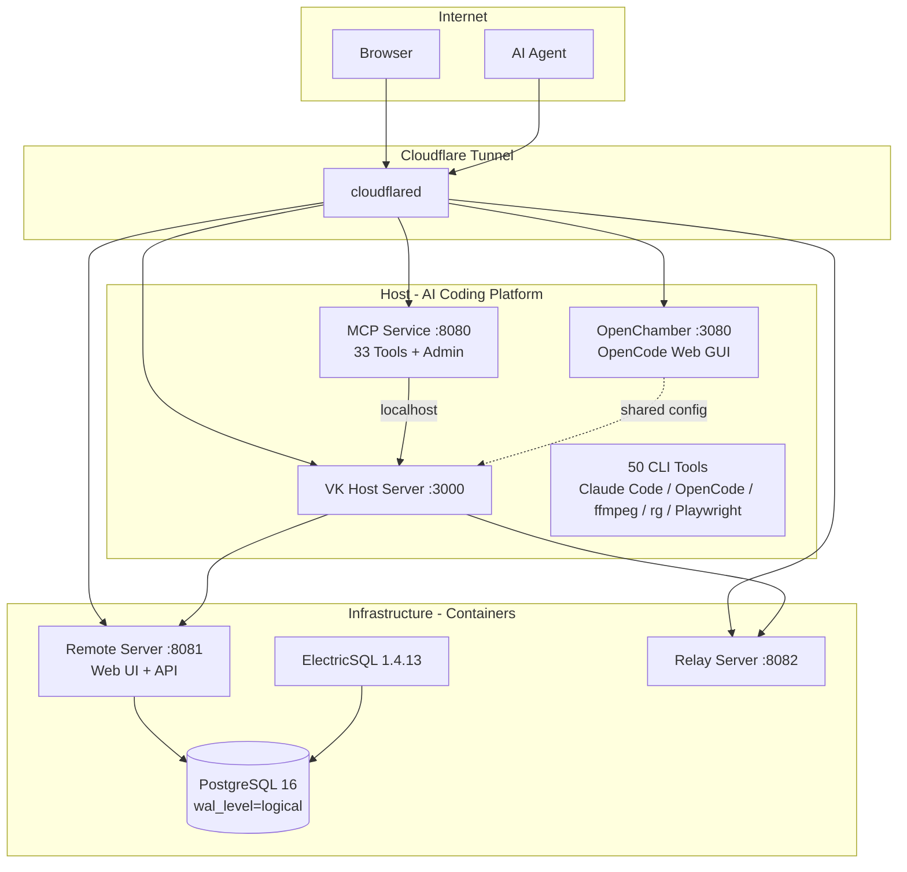

<p align="center">
  
</p>

<h1 align="center">Woow Vibe Kanban Docker Compose All</h1>

<p align="center">
  <strong>Complete Self-Hosted Vibe Kanban Suite</strong><br/>
  K3s Kubernetes | Podman + Ubuntu Native
</p>

<p align="center">
  
  
  
  
  
  
</p>

---

## Deployment Options

| | K3s / Kubernetes | Podman + Ubuntu |
|---|---|---|
| **Branch** | [`k3s`](../../tree/k3s) | [`podman-ubuntu`](../../tree/podman-ubuntu) |
| **Host** | 3 sidecars (Host + MCP + OpenChamber) | Native systemd service |
| **Infra** | K8s Deployments + Services | podman-compose (4 containers) |
| **MCP** | Sidecar (33 tools, StreamableHttp) | — |
| **OpenChamber** | Sidecar (OpenCode Web GUI) | — |
| **Terminal** | ttyd (K8s pod) | ttyd (systemd) |
| **Tunnel** | Dedicated CF Tunnel (7 routes) | CF Tunnel |
| **Best for** | Production, multi-service | Development, single machine |

## Architecture



## What's Included

### Core Platform
- **PostgreSQL 16** — WAL logical replication for ElectricSQL
- **ElectricSQL 1.4.13** — Real-time data sync
- **Remote Server** — Kanban Web UI + REST API (v0.1.43)
- **Relay Server** — WebSocket host connections

### AI-Powered Host (K3s: 3 sidecar containers)
- **VK Host Server** — Workspace executor with Claude Code + OpenCode
- **MCP Service** — 33 VK tools via authenticated StreamableHttp + admin GUI
- **OpenChamber** — Full OpenCode Web GUI (chat, Git, voice, multi-agent)
- **Shared Config** — OpenChamber manages OpenCode config, Host reads it via PVC

### 50 CLI Tools
| Category | Tools |
|----------|-------|
| AI Agents | Claude Code 2.1+, OpenCode 1.18+ |
| Languages | Python 3.12, Node.js 22, npm, corepack |
| Multimedia | ffmpeg 7.0.2, ffprobe |
| Search | ripgrep 14.1, ddgs (DuckDuckGo) |
| Browser | Playwright 1.61 + Chromium |
| Document | OfficeCLI 1.0.136 (docx/xlsx/pptx) |
| Package Mgr | uv 0.11+, pip |
| Runtime | .NET 8.0 |
| Python (92 pkgs) | anthropic, openai, mcp, fastapi, numpy, pandas... |

## Live Instance

| Service | URL |
|---------|-----|
| Remote (Web UI) | https://woowtechkxs-vibekanban.woowtech.io |
| Host UI | https://woowtechkxs-vibekanban-host.woowtech.io |
| OpenChamber | https://woowtechkxs-vibekanban-opencode.woowtech.io |
| MCP Admin | https://woowtechkxs-vibekanban-mcp.woowtech.io |
| Terminal | https://woowtechkxs-vibekanban-terminal.woowtech.io |
| Relay | https://woowtechkxs-vibekanban-relay.woowtech.io |
| MCP Endpoint | https://woowtechkxs-vk-mcp.woowtech.io/mcp |

## Related Repos
- [Woow VK MCP Server](https://github.com/WOOWTECH/Woow_vk_mcp_server) — MCP service source

## Quick Start

### K3s
```bash
git checkout k3s
kubectl apply -f k8s-manifests/vibe-kanban/
```

### Podman
```bash
git checkout podman-ubuntu
cd podman-stack && cp .env.example .env
bash start.sh && bash install-host-tools.sh
```

---

<p align="center"><sub>Built by <a href="https://github.com/WOOWTECH">WOOWTECH</a></sub></p>
