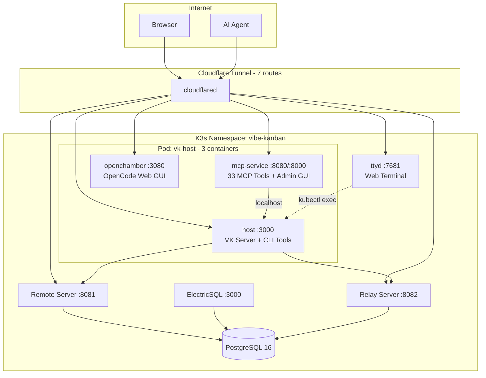

<p align="center">
  
</p>

<h1 align="center">Woow Vibe Kanban — K3s Deployment</h1>

<p align="center">
  <strong>Complete Self-Hosted Vibe Kanban on K3s/Kubernetes</strong><br/>
  8 Services · 3 Sidecar Containers · MCP Server · OpenChamber · Web Terminal
</p>

<p align="center">
  
  
  
  
  <a href="README_zh-TW.md">中文</a>
</p>

---

## Architecture



## Components

| Pod | Container(s) | Ports | Purpose |
|-----|-------------|-------|---------|
| vk-db | postgres | 5432 | PostgreSQL 16 (wal_level=logical) |
| vk-remote | remote | 8081 | Web UI + REST API |
| vk-electric | electric | 3000 | Real-time sync (ElectricSQL 1.4.13) |
| vk-relay | relay | 8082 | Host connection relay |
| **vk-host** | **host** | 3000 | VK Host Server + 50 CLI tools |
| | **mcp-service** | 8080, 8000 | MCP Admin + Supergateway (33 tools) |
| | **openchamber** | 3080 | OpenCode Web GUI (OpenChamber) |
| vk-terminal | ttyd | 7681 | Browser-based shell |
| vk-cloudflared | cloudflared | — | CF Tunnel (7 routes) |

## External URLs

| Service | URL |
|---------|-----|
| Remote (Web UI) | `woowtechkxs-vibekanban.woowtech.io` |
| Relay | `woowtechkxs-vibekanban-relay.woowtech.io` |
| Host UI | `woowtechkxs-vibekanban-host.woowtech.io` |
| Terminal | `woowtechkxs-vibekanban-terminal.woowtech.io` |
| MCP Admin | `woowtechkxs-vibekanban-mcp.woowtech.io` |
| OpenChamber | `woowtechkxs-vibekanban-opencode.woowtech.io` |
| MCP Direct | `woowtechkxs-vk-mcp.woowtech.io/mcp` |

## CLI Tools (Host Container)

| Tool | Version | Type |
|------|---------|------|
| Claude Code | 2.1.201 | AI Agent |
| OpenCode | 1.18.4 | AI Agent |
| OfficeCLI | 1.0.136 | Document Automation |
| ffmpeg/ffprobe | 7.0.2 | Multimedia |
| ripgrep | 14.1.1 | Search |
| Playwright + Chromium | 1.61.0 | Browser Automation |
| uv | 0.11.28 | Python Package Manager |
| .NET Runtime | 8.0.28 | Runtime |
| Python venv (92 pkgs) | anthropic/openai/mcp/fastapi/numpy/pandas | Libraries |

## Key Features (since initial release)

- **OpenChamber sidecar** — Full OpenCode Web GUI with chat, Git, voice mode
- **MCP Service sidecar** — 33 VK tools via StreamableHttp, token auth, admin GUI
- **Shared OpenCode config** — OpenChamber and Host share same config via PVC
- **Persistent ~/.local** — profiles.json, auth, DB survive restarts
- **OpenCode v1.18.4** — base_command_override in profiles.json
- **Dotfile fix** — OPENCHAMBER_DIST_DIR workaround for SPA 404
- **50 CLI tools** — all persisted on NFS PVC via initContainer

## Deploy

```bash
kubectl apply -f k8s-manifests/vibe-kanban/
```

See individual manifest files for configuration details.

---

<p align="center"><sub>Built by <a href="https://github.com/WOOWTECH">WOOWTECH</a></sub></p>
