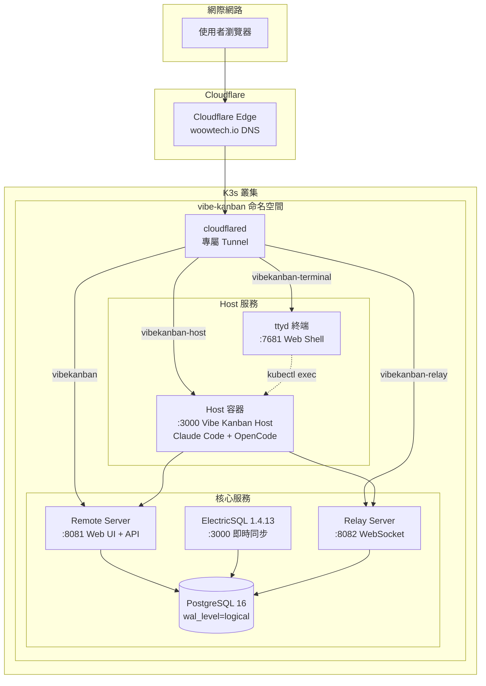
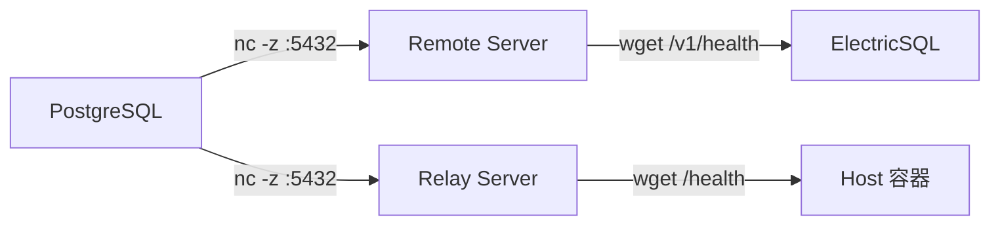

<p align="center">
  
</p>

<h1 align="center">Woow Vibe Kanban Docker Compose All</h1>

<p align="center">
  <strong>完整自架 Vibe Kanban 套件 — K3s / Kubernetes 部署</strong><br/>
  Remote Server + Relay + ElectricSQL + Host（Claude Code & OpenCode）+ Web Terminal
</p>

<p align="center">
  <a href="#功能特色">功能特色</a> &bull;
  <a href="#系統架構">系統架構</a> &bull;
  <a href="#元件說明">元件說明</a> &bull;
  <a href="#畫面截圖">畫面截圖</a> &bull;
  <a href="#部署指南">部署指南</a> &bull;
  <a href="#設定說明">設定說明</a> &bull;
  <a href="#驗證測試">驗證測試</a> &bull;
  <a href="README.md">English</a>
</p>

<p align="center">
  
  
  
  
  
  
  
</p>

---

## 概述

在 K3s / Kubernetes 上完整部署 [Vibe Kanban](https://github.com/BloopAI/vibe-kanban) 的生產級方案。全部 7 個服務運行在同一個 `vibe-kanban` namespace，搭配專屬 Cloudflare Tunnel 對外存取。

Host 容器預裝 **Claude Code CLI** 和 **OpenCode**（搭配 MiniMax M3），可直接透過瀏覽器終端進行 AI 輔助開發。

### 為什麼需要這個套件？

| 挑戰 | 解決方案 |
|------|----------|
| Vibe Kanban 上游已停止更新（v0.1.44 僅匯出） | 鎖定 v0.1.43，使用預建二進位 + 重建前端 |
| Host 原本是原生執行，無法容器化 | 自訂 Docker 映像：Ubuntu 24.04 + server 二進位 + AI 工具 |
| OpenCode/Claude Code 需要終端存取 | 基於 ttyd 的 Web 終端 + kubectl exec 連入 Host Pod |
| ElectricSQL 需要嚴格的啟動順序 | InitContainer 確保 DB → Remote → Electric 依序啟動 |
| 多服務 Cloudflare 路由 | 專屬 Tunnel，API 管理 ingress 規則 |

---

## 功能特色

### 核心平台
- **PostgreSQL 16** — `wal_level=logical`，支援 ElectricSQL 即時同步
- **ElectricSQL 1.4.13** — 即時資料同步引擎
- **Remote Server** — Web UI + REST API（Vibe Kanban v0.1.43）
- **Relay Server** — WebSocket 中繼，連接 Host

### AI 驅動的 Host
- **Claude Code CLI**（v2.1.201）— Anthropic 終端 AI 程式碼代理
- **OpenCode**（v1.17.13）— 開源 AI 程式碼代理，支援 75+ LLM 供應商
- **MiniMax M3** — 預設 AI 供應商（Token Plan）
- **Git、Node.js 22、NPM** — 容器內完整開發環境

### 基礎設施
- **Web Terminal（ttyd）** — 瀏覽器直接存取 Host 容器終端
- **專屬 Cloudflare Tunnel** — API 管理路由，不影響其他服務
- **NetworkPolicy** — 資料庫隔離、服務級存取控制
- **NFS 工作區** — 20Gi 持久儲存，存放 worktree 和設定
- **InitContainer 排序** — 保證正確的啟動順序

---

## 系統架構

### 系統總覽



### 啟動順序（由 InitContainer 強制）



### 網路拓撲

```
對外 URL（經 Cloudflare Tunnel）:
  ┌─────────────────────────────────────────────────────────────┐
  │ woowtechkxs-vibekanban.woowtech.io          → Remote:8081  │
  │ woowtechkxs-vibekanban-relay.woowtech.io     → Relay:8082  │
  │ woowtechkxs-vibekanban-host.woowtech.io      → Host:3000   │
  │ woowtechkxs-vibekanban-terminal.woowtech.io  → ttyd:7681   │
  └─────────────────────────────────────────────────────────────┘

內部服務（ClusterIP）:
  vk-db-svc:5432        vk-remote-svc:8081
  vk-electric-svc:3000  vk-relay-svc:8082
  vk-host-svc:3000      vk-terminal-svc:7681
```

---

## 元件說明

### Manifest 檔案

| 檔案 | 元件 | 說明 |
|------|------|------|
| `00-namespace.yaml` | Namespace | `vibe-kanban` 命名空間 |
| `01-secrets.yaml.example` | Secrets | JWT、資料庫密碼、API 金鑰（範本） |
| `02-config.yaml` | ConfigMap | 公開 URL |
| `03-storage.yaml` | PVC | DB（10Gi）、Electric（1Gi）、工作區（20Gi NFS） |
| `04-postgres.yaml` | PostgreSQL 16 | WAL 邏輯複寫資料庫 |
| `05-remote.yaml` | Remote Server | Web UI + REST API |
| `06-electric.yaml` | ElectricSQL | 即時同步引擎 |
| `07-relay.yaml` | Relay Server | Host 連線中繼 |
| `08-host.yaml` | Host | AI 程式碼執行器（Claude Code + OpenCode） |
| `09-cloudflared.yaml` | Cloudflared | 專屬 Cloudflare Tunnel |
| `10-network-policy.yaml` | NetworkPolicy | 服務隔離 |
| `11-terminal.yaml` | Web Terminal | ttyd 瀏覽器終端 |
| `build-vk-images.sh` | 建構腳本 | 映像建構流程 |

### 容器映像

| 映像 | 基礎 | 大小 | 內容 |
|------|------|------|------|
| `vk-remote:v0.1.43` | ubuntu:24.04 | ~200MB | Remote Server 二進位 + 前端 |
| `vk-relay:v0.1.43` | ubuntu:24.04 | ~110MB | Relay Server 二進位 |
| `vk-host:v0.1.43` | ubuntu:24.04 | ~850MB | Host Server + Node.js 22 + Claude Code + OpenCode |

---

## 畫面截圖

### Remote Server — 登入頁面

Remote Server 提供 Vibe Kanban Web 介面，支援本地驗證登入。

<p align="center">
  
</p>

### Remote Server — 儀表板

專案管理儀表板，含看板、議題追蹤和即時同步。

<p align="center">
  
</p>

### Host UI — 引導設定

Host 容器提供自有 Web UI，管理工作區和執行器。

<p align="center">
  
</p>

### Web Terminal（ttyd）

瀏覽器終端直接存取 Host 容器。可執行 `claude`、`opencode`、`git` 等指令。

<p align="center">
  
</p>

### 健康檢查端點

所有服務皆提供健康檢查端點供監控使用。

<p align="center">
  
  
</p>

### Kubernetes Pod 狀態

`vibe-kanban` namespace 中全部 7 個 Pod 運行中：

```
NAME                             READY   STATUS    RESTARTS   AGE
vk-cloudflared-8c7d94dc7-lwzk6   1/1     Running   0          23h
vk-db-797576d855-sl754           1/1     Running   1          23h
vk-electric-58b559f886-fl7h2     1/1     Running   1          23h
vk-host-7cd49c484d-7ghws         1/1     Running   1          22h
vk-relay-85f989bff4-4gxhl        1/1     Running   1          23h
vk-remote-59dff84b-q9cnj         1/1     Running   1          23h
vk-terminal-6d76c74f4f-f6wdj     1/1     Running   0          23h
```

---

## 部署指南

### 前置需求

- K3s / Kubernetes 叢集（v1.28+）
- `kubectl` 已設定叢集存取
- `podman` 或 `docker` 用於建構映像
- Cloudflare 帳號及 API Token（建立 Tunnel 用）
- Vibe Kanban 原始碼（`git clone https://github.com/BloopAI/vibe-kanban.git`）

### 步驟 1：建構映像

```bash
# 切換到 v0.1.43 tag
cd /path/to/vibe-kanban
git checkout v0.1.43-20260417125614

# 建構前端（Relay URL 烤入 JS bundle）
VITE_RELAY_API_BASE_URL="https://your-relay.example.com" \
  NODE_OPTIONS="--max-old-space-size=4096" \
  pnpm -C packages/local-web build
pnpm -C packages/remote-web build

# 建構 Host 二進位
export LIBCLANG_PATH=/usr/lib/llvm-18/lib OPENSSL_NO_VENDOR=1
cargo build --release --bin server

# 建構容器映像
chmod +x k8s-manifests/vibe-kanban/build-vk-images.sh
./k8s-manifests/vibe-kanban/build-vk-images.sh
```

### 步驟 2：匯入映像到 K3s

```bash
podman save localhost/vk-remote:v0.1.43 | sudo k3s ctr images import -
podman save localhost/vk-relay:v0.1.43  | sudo k3s ctr images import -
podman save localhost/vk-host:v0.1.43   | sudo k3s ctr images import -
```

### 步驟 3：建立 Cloudflare Tunnel

```bash
# 建立 Tunnel
curl -X POST "https://api.cloudflare.com/client/v4/accounts/{帳號ID}/cfd_tunnel" \
  -H "Authorization: Bearer {API_TOKEN}" \
  -d '{"name":"vibe-kanban-k3s","tunnel_secret":"'$(openssl rand -base64 32)'"}'

# 設定路由（4 個 hostname + 預設 404）
# 建立 DNS CNAME 記錄指向 {TUNNEL_ID}.cfargotunnel.com
```

### 步驟 4：設定 Secrets

```bash
cp k8s-manifests/vibe-kanban/01-secrets.yaml.example k8s-manifests/vibe-kanban/01-secrets.yaml
# 編輯 01-secrets.yaml，填入實際值
```

### 步驟 5：部署

```bash
kubectl apply -f k8s-manifests/vibe-kanban/
```

---

## 設定說明

### Host 環境變數

| 變數 | 說明 |
|------|------|
| `HOST` | 綁定位址（`0.0.0.0`） |
| `PORT` | 監聽埠（`3000`） |
| `VK_SHARED_API_BASE` | Remote Server URL |
| `VK_SHARED_RELAY_API_BASE` | Relay Server URL |
| `MINIMAX_API_KEY` | MiniMax Token Plan API 金鑰 |

### Host 內的 AI 工具

| 工具 | 版本 | 使用方式 |
|------|------|----------|
| Claude Code | v2.1.201 | `claude`（首次需登入） |
| OpenCode | v1.17.13 | `opencode`（預設 MiniMax M3） |
| OpenCode 非互動 | — | `opencode run "你的指令"` |

---

## 驗證測試

```bash
# 1. 確認所有 Pod 運行中
kubectl get pods -n vibe-kanban

# 2. 健康檢查
curl https://your-remote.example.com/v1/health
curl https://your-relay.example.com/health

# 3. 登入測試
curl -X POST https://your-remote.example.com/v1/auth/local/login \
  -H "Content-Type: application/json" \
  -d '{"email":"admin@example.com","password":"your-password"}'

# 4. AI 工具確認
kubectl exec -n vibe-kanban deploy/vk-host -c host -- claude --version
kubectl exec -n vibe-kanban deploy/vk-host -c host -- opencode --version
```

---

## 踩坑紀錄

| 問題 | 根因 | 解法 |
|------|------|------|
| PostgreSQL 拒絕啟動 | `command:` 覆蓋 entrypoint | 改用 `args:` |
| ElectricSQL「使用者名稱無效」 | `$(VAR)` 展開不支援 `valueFrom` | 在 Secret 中預建完整 URL |
| Host GLIBC 不符 | 二進位在 Ubuntu 24.04 編譯，容器用 Debian | 基礎映像改用 ubuntu:24.04 |
| Host 使用隨機 Port | Server 預設 port 0 | 設定 `PORT=3000` + `HOST=0.0.0.0` |
| OpenCode「agent 找不到」 | 安裝了錯誤的專案 | 從 https://opencode.ai/install 安裝 |
| 前端顯示「Build web app first」 | `local-web` 在編譯時嵌入 | 先建構 local-web 再 `cargo build` |

---

## 支援

- 問題回報：[GitHub Issues](https://github.com/WOOWTECH/Woow_vibekanban_docker_compose_all/issues)
- 電子郵件：woowtech@designsmart.com.tw

---

## 授權

MIT License - 詳見 [LICENSE](LICENSE)

---

<p align="center">
  <sub>由 <a href="https://github.com/WOOWTECH">WOOWTECH</a> 建構 | 基於 <a href="https://github.com/BloopAI/vibe-kanban">Vibe Kanban</a> + <a href="https://opencode.ai">OpenCode</a></sub>
</p>
